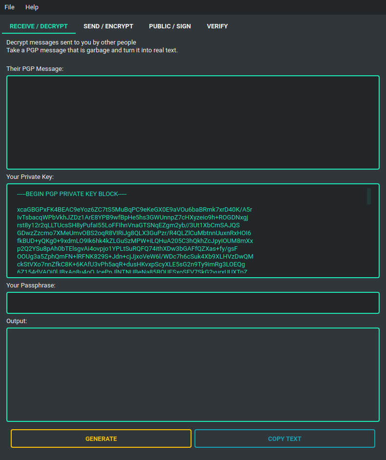

# pypgpeed

## 'py-p-g-peed' A PGP Gui utility

Create pgp keys, encrypt and decrypt messages, sign messages and verify messages.

Perfect for the novice to begin secure communication online.


**Example of GUI:**



## Usage - if you don't have python or don't even know what that is.

> ### Windows
> Just click [here](https://drive.google.com/u/0/uc?id=1s_dl9kKAeAH3qqE243vIbR3dvXY8ORYw&export=download) and run. It's a hefty file like this... but it is what it is.
> 
> ### Linux
> Come on what are you playing at ... read below.
> 
> ### Mac
> Literally no idea if it works, but I believe just follow the instructions below. 

## Installation - if you have python installed.

Download and install can be done through PyPi

```
pip install pypgpeed
```

or

```python
git clone https://github.com/lewis-morris/pypgpeed
cd pypgpeed
pip install - e.
```

## Running

> ### Linux & Windows
> 
> Once installed you should be able to run in the console. `pypgpeed`
>
> If this does not work you can run with `python -c "from pypgpeed import run_gui; run_gui()"`

## Usage

To begin communicating via PGP you will need a private and a public key, this software enforces that you have a
passphrase attached to your private key for extra security.

If you do not have a set of keys. Please start by clicking  `file >> Generate New Keys` and follow the instructions to
generate the PGP keys you will need.

If you already have a set of keys, you can either enter the plaintext into the relevant boxes where needed, or autoload
them by choosing their containing directory with `file >> Set Key Location`, please beware that they must be
called `pri_key.key` and `pub_key.key`  

The rest is self explanatory...